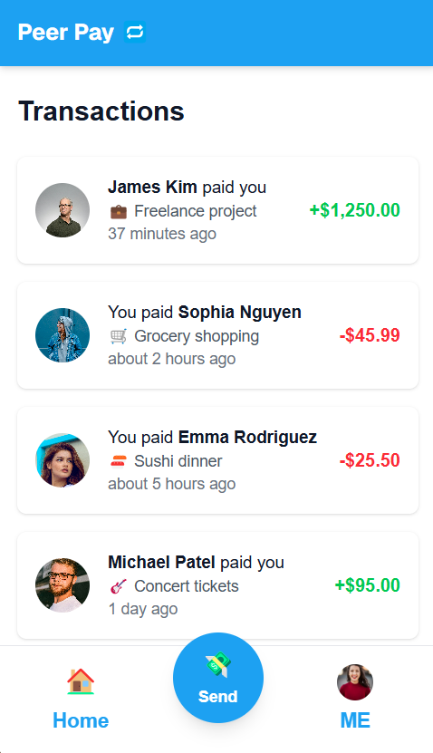

# PeerPay

A modern peer-to-peer payment application built with Next.js 15 and React 19. Send and receive payments with ease through a beautiful, user-friendly interface.

🌐 [Live Demo](https://peer-pay-danny-g.netlify.app/home)



## 🚀 Features

- Modern and responsive UI built with React 19
- Server-side rendering with Next.js 15
- Type-safe development with TypeScript
- State management with Zustand
- Beautiful animations with Framer Motion
- Toast notifications with React Hot Toast
- Date formatting with date-fns
- Styling with Tailwind CSS
- Real-time transaction tracking
- Secure payment processing
- User-friendly payment history
- Mobile-responsive design

## 📋 Prerequisites

Before you begin, ensure you have the following installed:

- Node.js (LTS version recommended)
- npm or yarn package manager

## 🛠️ Installation

1. Clone the repository:

```bash
git clone https://github.com/dgarcia1724/peerPay.git
cd peer-pay
```

2. Install dependencies:

```bash
npm install
# or
yarn install
```

## 🚀 Development

To start the development server:

```bash
npm run dev
# or
yarn dev
```

Open [http://localhost:3000](http://localhost:3000) in your browser to see the application.

## 🧪 Testing

The project uses Jest and React Testing Library for testing. To run tests:

```bash
# Run tests once
npm run test

# Run tests in watch mode
npm run test:watch
```

## 📦 Build

To create a production build:

```bash
npm run build
# or
yarn build
```

To start the production server:

```bash
npm run start
# or
yarn start
```

## 🔧 Tech Stack

- [Next.js](https://nextjs.org/) - React framework for production
- [React](https://reactjs.org/) - UI library
- [TypeScript](https://www.typescriptlang.org/) - Type safety
- [Zustand](https://github.com/pmndrs/zustand) - State management
- [Framer Motion](https://www.framer.com/motion/) - Animations
- [Tailwind CSS](https://tailwindcss.com/) - Styling
- [Jest](https://jestjs.io/) - Testing framework
- [React Testing Library](https://testing-library.com/docs/react-testing-library/intro/) - Testing utilities

## 📝 License

This project is licensed under the MIT License - see the [LICENSE](LICENSE) file for details.

## 👥 Contributing

Contributions are welcome! Please feel free to submit a Pull Request.

1. Fork the project
2. Create your feature branch (`git checkout -b feature/AmazingFeature`)
3. Commit your changes (`git commit -m 'Add some AmazingFeature'`)
4. Push to the branch (`git push origin feature/AmazingFeature`)
5. Open a Pull Request

## 📫 Contact

Danny Garcia - [GitHub](https://github.com/dgarcia1724)

Project Links:

- Repository: [https://github.com/dgarcia1724/peerPay](https://github.com/dgarcia1724/peerPay)
- Live Demo: [https://peer-pay-danny-g.netlify.app/home](https://peer-pay-danny-g.netlify.app/home)
